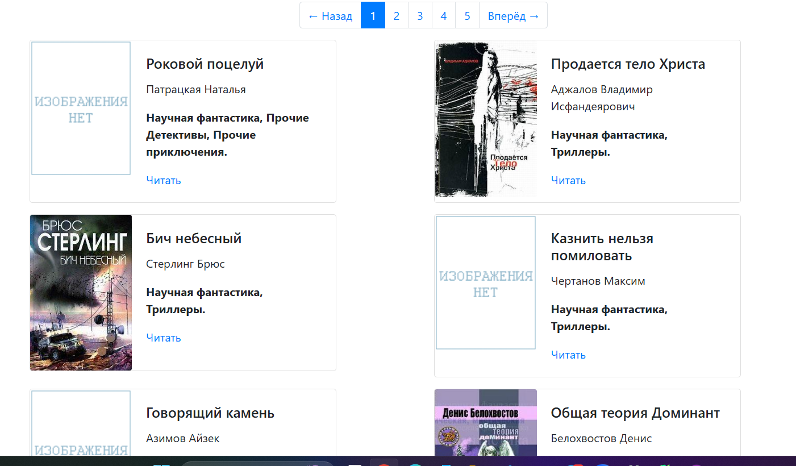

# Онлайн-библиотеку
Позволяет читать книги онлайн
## Как установить


  - ***Операционная система:***  
    - Windows 10 или новее
    - macOS 10.14 или новее
    - Linux (разные дистрибутивы)

  - ***Язык программирования:***  
    - Python 3.6 или новее


  ## Установка окружения


  1. Создайте виртуальное окружение:
        ```bash
        python -m venv venv
        ```

  3. Активируйте виртуальное окружение:
   
        На Windows:
      
        ```bash
        venv\Scripts\activate
        ```
        На macOS/Linux:
        ```bash
        source venv/bin/activate
        ```

  4. Установите зависимости:
      ```bash
     pip install -r requirements.txt
      ```

5. Для рендера страниц сайта
`python render_website.py`

6. Для запуска обновлений
`python server.py`

7. [Сайт](https://artyomrom.github.io/Online-library/)
